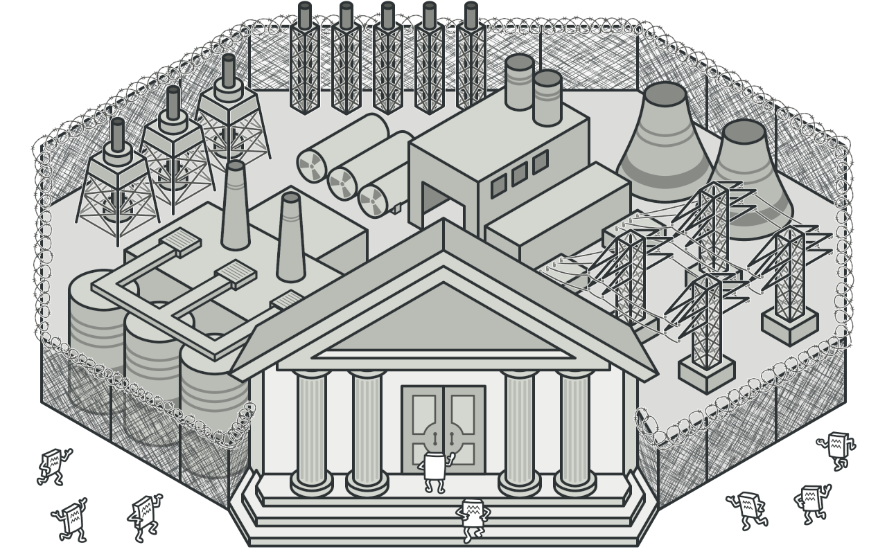
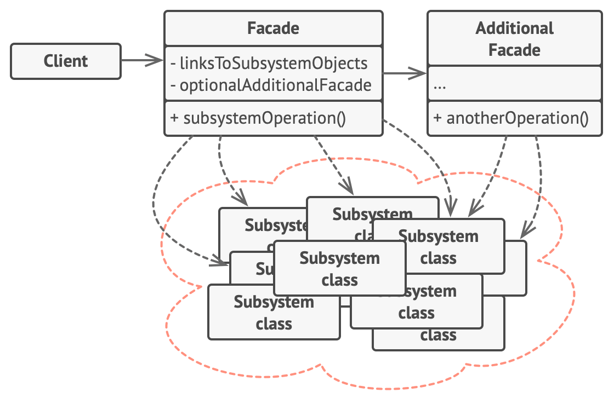
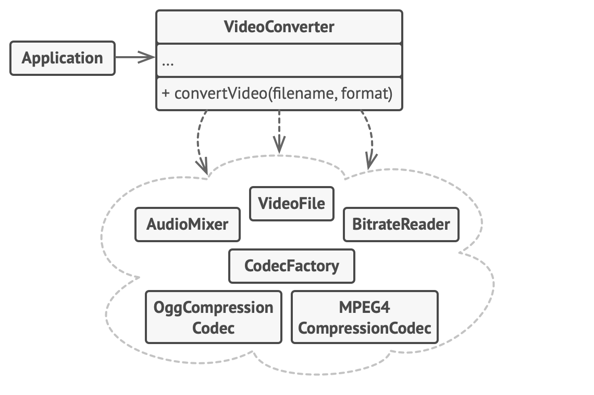

# Patrón de Diseño Fachada (Facade)

El patrón de diseño Fachada (Facade) es un patrón estructural que proporciona una interfaz simplificada a un conjunto complejo de interfaces dentro de un sistema. Este patrón define una clase de alto nivel que actúa como un punto de entrada único, ocultando las complejidades y facilitando su uso por parte de los clientes.

## Uso y Función

## Uso Principal:

Simplificar el acceso a sistemas complejos mediante la creación de una interfaz única que encapsula la funcionalidad subyacente.
Reducir el acoplamiento entre el cliente y los subsistemas complejos, promoviendo una arquitectura más manejable y flexible.

## Función:

**Encapsulación de la Complejidad:**
La Fachada oculta la complejidad de los subsistemas al proporcionar métodos que realizan operaciones específicas sin exponer los detalles internos. Esto permite que los clientes interactúen con el sistema de manera más intuitiva y directa.

**Reducción del Acoplamiento:**
Al introducir una interfaz común para varios subsistemas, se reduce la dependencia del cliente en los componentes internos específicos. Esto facilita la modificación y evolución de los subsistemas sin afectar a los clientes.

**Mejora de la Mantenibilidad:**
La Fachada centraliza la lógica de interacción con los subsistemas, lo que facilita la localización y resolución de problemas, además de permitir mejoras o cambios en la funcionalidad sin impacto directo en los usuarios del sistema.

**Facilidad de Uso:**
Proporciona una forma más sencilla y coherente de realizar operaciones comunes, mejorando la experiencia del desarrollador al reducir la curva de aprendizaje y el riesgo de errores.

## Estructura

El patrón Facade proporciona un práctico acceso a una parte específica de la funcionalidad del subsistema. Sabe a dónde dirigir la petición del cliente y cómo operar todas las partes móviles.

Puede crearse una clase Fachada Adicional para evitar contaminar una única fachada con funciones no relacionadas que podrían convertirla en otra estructura compleja. Las fachadas adicionales pueden utilizarse por clientes y por otras fachadas.

El Subsistema Complejo consiste en decenas de objetos diversos. Para lograr que todos hagan algo significativo, debes profundizar en los detalles de implementación del subsistema, que pueden incluir inicializar objetos en el orden correcto y suministrarles datos en el formato adecuado.

Las clases del subsistema no conocen la existencia de la fachada. Operan dentro del sistema y trabajan entre sí directamente.

El Cliente utiliza la fachada en lugar de invocar directamente los objetos del subsistema.

## **Pseudocódigo**

En este ejemplo, el patrón Facade simplifica la interacción con un framework complejo de conversión de vídeo.

Un ejemplo de aislamiento de múltiples dependencias dentro de una única clase fachada.

## **Aplicabilidad**

Utiliza el patrón Facade cuando necesites una interfaz limitada pero directa a un subsistema complejo.

A menudo los subsistemas se vuelven más complejos con el tiempo. Incluso la aplicación de patrones de diseño suele conducir a la creación de un mayor número de clases. Un subsistema puede hacerse más flexible y más fácil de reutilizar en varios contextos, pero la cantidad de código de configuración que exige de un cliente, crece aún más. El patrón Facade intenta solucionar este problema proporcionando un atajo a las funciones más utilizadas del subsistema que mejor encajan con los requisitos del cliente.

Utiliza el patrón Facade cuando quieras estructurar un subsistema en capas.

Crea fachadas para definir puntos de entrada a cada nivel de un subsistema. Puedes reducir el acoplamiento entre varios subsistemas exigiéndoles que se comuniquen únicamente mediante fachadas.

## **Cómo implementarlo**

Comprueba si es posible proporcionar una interfaz más simple que la que está proporcionando un subsistema existente. Estás bien encaminado si esta interfaz hace que el código cliente sea independiente de muchas de las clases del subsistema.

Declara e implementa esta interfaz en una nueva clase fachada. La fachada deberá redireccionar las llamadas desde el código cliente a los objetos adecuados del subsistema. La fachada deberá ser responsable de inicializar el subsistema y gestionar su ciclo de vida, a no ser que el código cliente ya lo haga.

Para aprovechar el patrón al máximo, haz que todo el código cliente se comunique con el subsistema únicamente a través de la fachada. Ahora el código cliente está protegido de cualquier cambio en el código del subsistema. Por ejemplo, cuando se actualice un subsistema a una nueva versión, sólo tendrás que modificar el código de la fachada.

Si la fachada se vuelve demasiado grande, piensa en extraer parte de su comportamiento y colocarlo dentro de una nueva clase fachada refinada.

## **Pros y contras**

Puedes aislar tu código de la complejidad de un subsistema.
Una fachada puede convertirse en un objeto todopoderoso acoplado a todas las clases de una aplicación.

## **Relaciones con otros patrones**

**Facade** define una nueva interfaz para objetos existentes, mientras que Adapter intenta hacer que la interfaz existente sea utilizable. Normalmente Adapter sólo envuelve un objeto, mientras que Facade trabaja con todo un subsistema de objetos.

**Abstract Factory** puede servir como alternativa a Facade cuando tan solo deseas esconder la forma en que se crean los objetos del subsistema a partir del código cliente.

**Flyweight** muestra cómo crear muchos pequeños objetos, mientras que Facade muestra cómo crear un único objeto que represente un subsistema completo.

**Facade y Mediator** tienen trabajos similares: ambos intentan organizar la colaboración entre muchas clases estrechamente acopladas.

**Facade** define una interfaz simplificada a un subsistema de objetos, pero no introduce ninguna nueva funcionalidad. El propio subsistema no conoce la fachada. Los objetos del subsistema pueden comunicarse directamente.
Mediator centraliza la comunicación entre componentes del sistema. Los componentes conocen únicamente el objeto mediador y no se comunican directamente.
Una clase fachada a menudo puede transformarse en una Singleton, ya que un único objeto fachada es suficiente en la mayoría de los casos.

Facade es similar a Proxy en el sentido de que ambos pueden almacenar temporalmente una entidad compleja e inicializarla por su cuenta. Al contrario que Facade, Proxy tiene la misma interfaz que su objeto de servicio, lo que hace que sean intercambiables.

